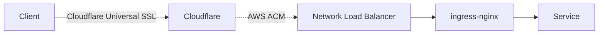

# 클러스터 Ingress

## 클러스터까지 요청이 도달하는 경로

## Client -> Cloudflare

- DNS Record 생성은 클러스터 내 External DNS가 관리한다
  - `spec.ingressClassName: nginx` 인 Ingress마다 ingress-nginx으로 라우팅되도록
    설정해준다
  - Proxy 설정은 켜준다
- Cloudflare Universal SSL/TLS 인증서로 인증한다
- TLS termination 한다

## Cloudflare -> NLB

- Cloudflare에서 `bacchus.io` 도메인 SSL/TLS encryption mode은 "Full (strict)"
  이다
- NLB는 ingress-nginx Service의 annotation을 보고 AWS Load Balancer Controller가
  생성한다
- AWS ACM 인증서 (Terraform에서 설정) 로 backend 인증한다
- 다시 한번 TLS termination 한다

> **Warning**
>
> NLB에서 Cloudflare외 요청을 막고 있지 않기 때문에 IP 주소를 아는 누구나 바로
> NLB에 바로 요청을 보내서 Cloudflare 설정 bypass가 가능하다. 특히, Cloudflare
> Access등 보안 설정도 bypass 가능하기 때문에 이 이슈 해결 전에는 Cloudflare
> 보안 설정을 사용하더라도 클러스터쪽에서 추가 인증(바쿠스 계정 로그인 등)을
> 거치도록 설정해야만 한다.
>
> NLB Security Group에서 Cloudflare IP 주소만 허용하는 것만으로는 충분하지 않다.
> 다른 Cloudflare 계정에서 NLB 주소를 backend로 설정하는 식으로 bypass 가능하기
> 때문. Authenticated Origin Pull이나 Cloudflare Tunnel 같은 기능을 사용해야
> 한다.

## NLB -> ingress-nginx

- AWS Load Balancer Controller가 NLB, Listener, Target Group등을 생성한다
- 클러스터 내 ingress-nginx Service에 `service.beta.kubernetes.io/*`
  annotation으로 설정한다
- 암호화하지 않지만 NLB->backend 연결은 AWS VPC 내부 traffic이기 때문에
  암호화하지 않아도 안전하다
  > [Configuring end-to-end encryption in a load-balanced Elastic Beanstalk
  > environment](https://docs.aws.amazon.com/elasticbeanstalk/latest/dg/configuring-https-endtoend.html)
  >
  > Terminating secure connections at the load balancer and using HTTP on the
  > backend might be sufficient for your application. Network traffic between
  > AWS resources can't be listened to by instances that are not part of the
  > connection, even if they are running under the same account.

## ingress-nginx -> Service

- `spec.ingressClassName: nginx` 인 Ingress를 추합해서 ingress-nginx 랴우팅을
  설정한다
- Ingress의 `nginx.ingress.kubernetes.io/*` annotation으로 추가 설정을 할 수
  있다
- 암호화하지 않는다
