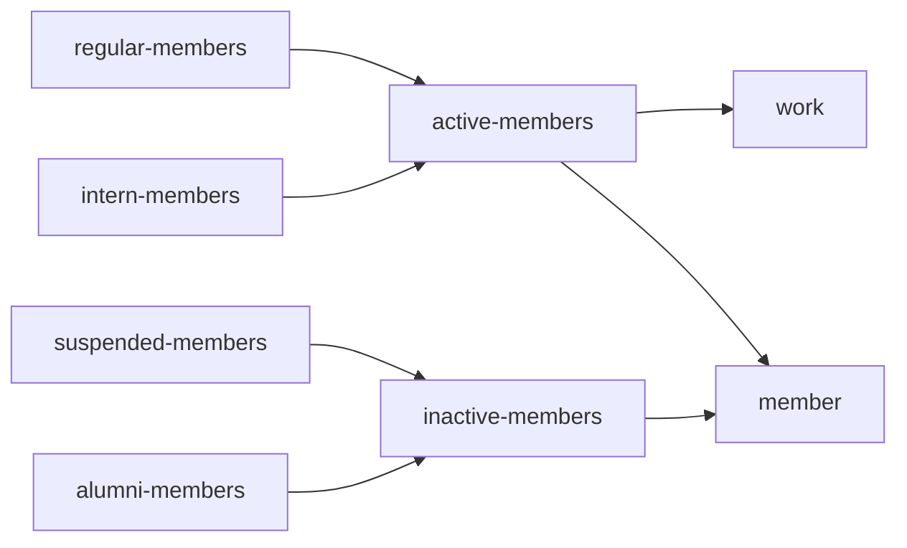

# 이메일

- 바쿠스의 주 연락처는 contact@bacchus.snucse.org이다. 만약 개인 이메일으로 바쿠스 업무 관련 이메일을 받은 경우 특별한 경우를 재외하고 contact로 포워드하도록 한다. 외부에 연락을 부탁드릴 때에도 반드시 이 메일주소를 사용한다.
- 바쿠스 업무 관련해서 이메일을 보낼 때는 특별한 경우를 재외하고 CC(참조)와 Reply-To(답장받는 주소)에 contact를 포함하도록 한다.
  - Reply-To 설정은 Gmail에서 (톱니바퀴 버튼 -> 모든 설정 보기 -> 계정 탭 -> 다른 주소에서 메일 보내기 -> 정보 수정) 에서 할 수 있다.
- 보내거나 받은 이메일에 민감한 정보(개인정보나 임시 비밀번호 등)가 있는 경우 해당 내용은 지우고 포워드하도록 한다.
- 과거 이메일 아카이브는 [구글 그룹](https://groups.google.com/a/bacchus.snucse.org/g/work)에서 확인할 수 있다.

## 이메일 계정

- 모든 바쿠스 회원은 입회 시 @bacchus.snucse.org 이메일 계정을 발급받는다. 바쿠스 활동에 관련해서 이메일을 보낼 때는 항상 이 이메일을 사용하도록 한다.
- 메일서버로는 Google Workspace를 사용하고 있다.

## 구글 그룹

- 바쿠스의 메일링 리스트는 구글 그룹으로 관리한다.
- 그룹 설정이나 회원 목록 등은 [구글 어드민](https://admin.google.com)에서 관리자 계정 (admin@snucse.org)으로 관리할 수 있다.

다음 메일링 리스트는 이메일 용도로 사용한다.

- contact@bacchus.snucse.org (work@bacchus.snucse.org)
  - 용도: 바쿠스의 주요 연락처
  - 회원: active-members@bacchus.snucse.org
  - 사실 그룹 이메일은 work@bacchus.snucse.org이고 contact는 alias이지만 이메일에서는 contact만 사용한다.
- member@bacchus.snucse.org
  - 용도: 바쿠스 전 회원에게 소식 전하기 (예절에 주의하자.)
  - 회원: active-members@bacchus.snucse.org, inactive-members@bacchus.snucse.org

다음 메일링 리스트는 이메일 용도로 사용할 수 있긴 하지만 회원 목록 관리 및 다른 메일링 리스트 구독용으로만 사용한다. 회원 변동이 있을 경우 지채없이 각 그룹 회원 목록에 반영하도록 한다.

- active-members@bacchus.snucse.org (활동회원)
  - 회원: regular-members@bacchus.snucse.org, intern-members@bacchus.snucse.org
- regular-members@bacchus.snucse.org (정회원)
  - 회원: 각 바쿠스 정회원
- intern-members@bacchus.snucse.org (준회원)
  - 회원: 각 바쿠스 준회원
- inactive-members@bacchus.snucse.org (비활동회원)
  - 회원: alumni-members@bacchus.snucse.org, suspended-members@bacchus.snucse.org
- alumni-members@bacchus.snucse.org (동문회원)
  - 회원: 각 바쿠스 동문회원
- suspended-members@bacchus.snucse.org (휴회원)
  - 회원: 각 바쿠스 휴회원
