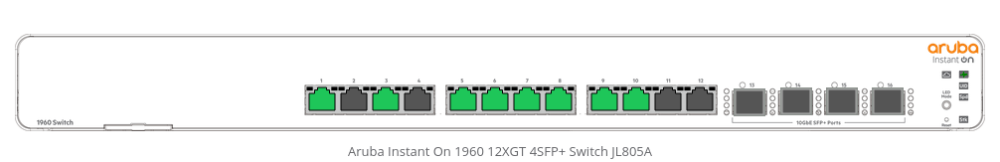
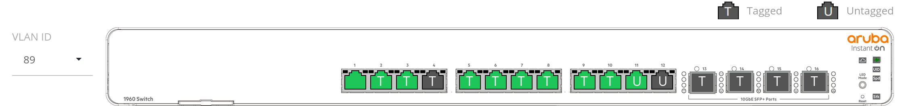
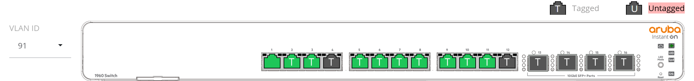

# BacchusNet

- Subnet range: 10.89.0.0/16
- Static range: 10.89.0.0/24
- DHCP range: 10.89.1.0~10.89.255.254
- VPN range: 10.90.0.0/16
- sommelier (GPU cluster): 10.91.0.0/16

## Static Range

- Static range는 BacchusNet 내에서 고정 IP를 설정하는 경우 사용하는 구간
- 아래 테이블 확인 후 할당한다

| Address    | Host             | Notes                                                                                 |
| ---------- | ---------------- | ------------------------------------------------------------------------------------- |
| 10.89.0.1  | kerkoporta       | Gateway                                                                               |
| 10.89.0.2  |                  | Switch                                                                                |
| 10.89.0.11 | fizz             | Proxmox host                                                                          |
| 10.89.0.12 | gin              | Proxmox host                                                                          |
| 10.89.0.13 | ramos            | Proxmox host                                                                          |
| 10.89.0.14 | ipmi_fizz        | fizz ipmi (ipmi_fizz.snucse.org)                                                      |
| 10.89.0.15 | ipmi_gin         | gin ipmi (ipmi_gin.snucse.org)                                                        |
| 10.89.0.16 | ipmi_ramos       | ramos ipmi (ipmi_ramos.snucse.org)                                                    |
| 10.89.0.17 | ipmi_ford        | ford ipmi (ipmi_ford.snucse.org)                                                      |
| 10.89.0.18 | ipmi_bentley     | bentley ipmi (ipmi_bentley.snucse.org) url로 연결 안 되기 때문에 ip로 연결 해야합니다 |
| 10.89.0.20 | waiter           | Waiter (Kubernetes) control plane VIP                                                 |
| 10.89.0.21 | control-1        | Waiter (Kubernetes) control plane                                                     |
| 10.89.0.22 | control-2        | Waiter (Kubernetes) control plane                                                     |
| 10.89.0.23 | control-3        | Waiter (Kubernetes) control plane                                                     |
| 10.89.0.24 | worker-1         | Waiter (Kubernetes) worker                                                            |
| 10.89.0.25 | worker-2         | Waiter (Kubernetes) worker                                                            |
| 10.89.0.26 | worker-3         | Waiter (Kubernetes) worker                                                            |
| 10.89.0.30 | gateway          | LB address, managed by Cilium                                                         |
| 10.89.0.31 | bacchus-vpn      | LB address, managed by Cilium for bacchus-vpn                                         |
| 10.89.0.32 | lab-vpn          | LB address, managed by Cilium for lab-vpn                                             |
| 10.89.0.33 | internal-gateway | internal gateway managed by Cilium                                                    |
| 10.89.0.51 | junebug          | 2024-1 Education VM                                                                   |
| 10.91.0.1  | kerkoporta       | Gateway                                                                               |
| 10.91.0.11 | control-1        | Sommelier (Kubernetes) control plane                                                  |
| 10.91.0.12 | control-2        | Sommelier (Kubernetes) control plane                                                  |
| 10.91.0.13 | control-3        | Sommelier (Kubernetes) control plane                                                  |
| 10.91.0.14 | ford             | ford GPU node                                                                         |
| 10.91.0.15 | bentley          | bentley GPU node                                                                      |
| 10.91.0.20 | http-proxy       | bacchusnet -> sommelier proxy                                                         |

## 라우터 / gateway

- 장소: 신양 Proxmox 클러스터 내 `kerkoporta`
- 주소: `10.89.0.1`
- OS: [pfSense](https://www.pfsense.org)
- [Console](https://10.89.0.1/) `admin / 리눅스 서버 비번`
- SSH: `10.89.0.1` `root / 리눅스 서버 비번`

### 중요한 라우터 설정

- 공식 Proxmox [가이드](https://docs.netgate.com/pfsense/en/latest/recipes/virtualize-proxmox-ve.html) 따라서 설정
  - 특히 "Disable hardware checksum offload" 선택
- Interfaces -> WAN: SNUNet 주소 설정
- Interfaces -> LAN: BacchusNet 주소 설정
- Interfaces -> OPT1: Sommelier 주소 설정
- Services -> DHCP Server: DHCP range
- Services -> DNS Server -> Host Overrides: waiter split horizon
  - waiter.bacchus.io -> 10.89.0.20 설정
  - sommelier.snucse.org -> 10.91.0.10 설정
- System -> Routing -> WANGW: Disable Gateway Monitoring
  - 쓸데없이 SNUNet gateway에 1초마다 핑 날리는거 비활성화
- Firewall -> NAT (port forward)
  - 6443 -> 10.89.0.20 (waiter)
    - 10.89.0.20는 Talos VIP 기능으로 healthy한 control plane에 자동으로 할당
    - 자세한 내용은 waiter 문서 확인
  - 6444 -> 10.91.0.10:6443 (sommelier)
  - 50000 -> 10.89.0.{21..23} (talos)
    - Talos endpoint는 highly available할 필요가 없고, control plane이 죽은 경우
      Talos endpoint에 접근해야 하니 VIP를 사용하면 안 됨
    - 자세한 내용은 waiter 문서 확인
  - 80,443 -> 10.89.0.30 (gateway)

## 스위치

- 장소: 신양 서버실 랙 맨 위
- 주소: `10.89.0.2`
- [Console](https://10.89.0.2): `bacchus / 리눅스 서버 비번`
- 기능은 많지만 지금은 VLAN만 사용한다

### 스위치 설정

- 12x10Gbit Ethernet (1~12)
  - 1 (uplink): VLAN 1 untagged
  - 2~10: VLAN 1 untagged, VLAN 89, 91 tagged
  - 11~12: VLAN 89 untagged, VLAN 1, 91 tagged
    - ford용
- 4x10Gbit SFP+ (13~16)
  - 미사용

## VPN

- 클러스터 내 `bacchus-vpn` namespace에
  [wg-access-server](https://github.com/freifunkMUC/wg-access-server) 설치해서
  사용중.
- [Web UI](https://vpn.bacchus.io)
