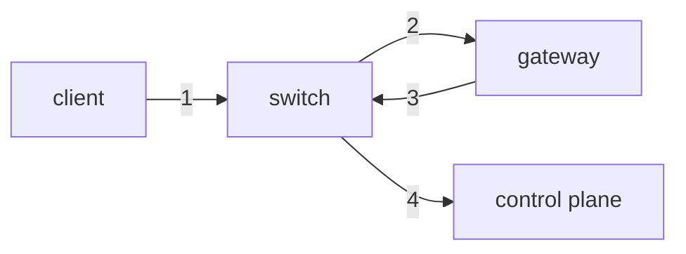

# waiter

- Talos endpoint: `10.89.0.{21..26}:50000`
  - `10.89.0.{21..23}`는 control plane
  - `10.89.0.{24..26}`는 worker
- Kubernetes endpoint: `https://waiter.bacchus.io:6443`
  - Gateway(kerkoporta)에서 `10.89.0.20`으로 포워드
  - `10.89.0.20`는 [Talos VIP](https://www.talos.dev/v1.5/talos-guides/network/vip/)
- 레포: [`cd-manifests/talos`](https://github.com/bacchus-snu/cd-manifests/tree/main/talos)
  - 기타 작업 가이드는 레포를 확인 (업데이트 등)
- 설정 레포: [`cd-manifests/argocd`](https://github.com/bacchus-snu/cd-manifests/tree/main/argocd)

## Vault

- [Web UI](https://vault.internal.bacchus.io): Method=oidc, 나머지 설정은 기본값으로 설정 후 로그인.
- CLI: `VAULT_ADDR=https://vault.internal.bacchus.io vault login -method=oidc`
- `secret/`에는 비밀키 등 설정을 저장한다.
  - `secret/{namespace}/*`는 해당 Kubernetes namespace에서 접근 가능하다.
- `passwords/`에는 비밀번호를 저장한다.
  - `passwords/members/` 에는 모든 회원이 접근 가능한 비밀번호를 저장한다.
  - `passwords/regular-members/` 에는 정회원만 접근 가능한 비밀번호를 저장한다.

### Unseal

- 어떤 이유로던 vault가 재시작하는 경우 unseal 해야한다.
  - 업그래이드, 노드 재시작, 등등...
- 바장과 부바장이 unseal key를 관리한다.
- `vault operator unseal` 에 unseal key 입력.

## NAT hairpinning

BacchusNet 내부에서 클러스터로 가는 요청은 모두 gateway를 통하기 때문에,
gateway가 죽으면 클러스터도 동작하지 않는다.

### current

1. `waiter.bacchus.io` 주소를 resolve 하면 gateway의 외부 IP 주소가 나오기 때문에
   gateway로 요청
2. gateway로 포워드
3. gateway 설정을 따라 `10.89.0.20`로 포워드
4. control plane leader에게 포워드

### ideal

1. `waiter.bacchus.io` 주소를 resolve 하면 BacchusNet 내부에서는 `10.89.0.20` 가
   나오도록 설정
   - 여기서 DNS dependency도 없에면 gateway가 죽어도 클러스터에는 문제가 없도록
     설정 가능
   - `/etc/hosts` 등등
2. control plane leader에게 포워드
